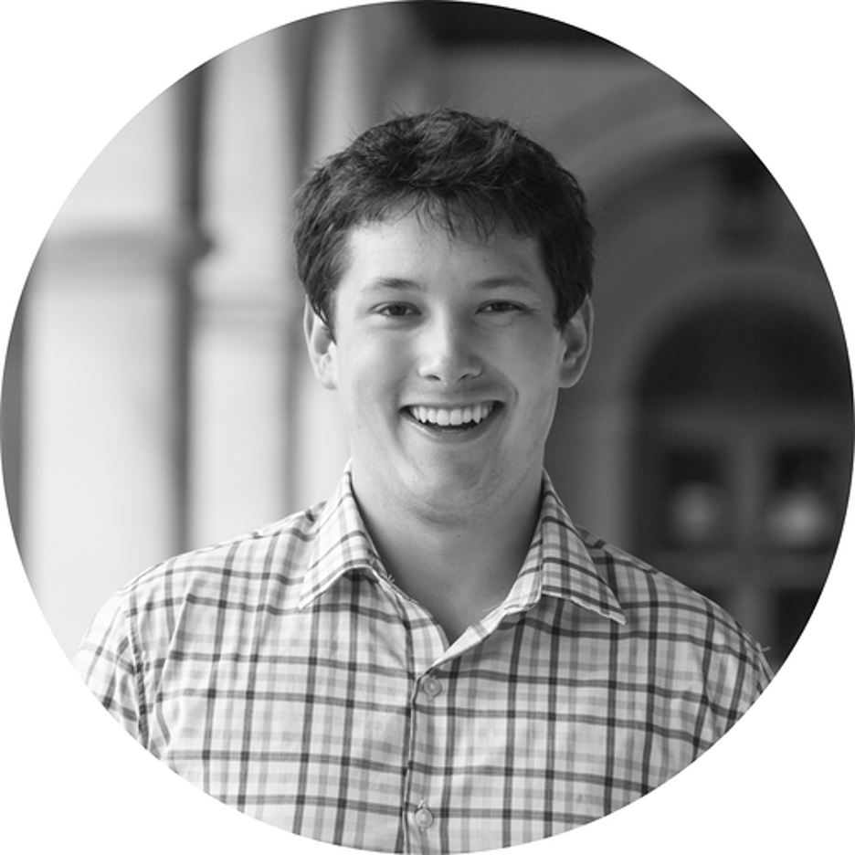

### Principal Investigator

<table style="border:none">
  <tr>
    <td style="border:none">  </td>
    <td style="border:none"> Dr. <b>Umberto Villa</b>   Research Assistant Professor  
      Electrical & Systems Engineering  
      McKelvey School of Engineering  
      Ph.D.in Applied Mathematics, Emory University (2012)  
      <a href="https://uvilla.github.io">Biography and Research</a>
</td>
  </tr>
</table>

  

### Current members

<table style="border:none">
  <tr>
    <td style="border:none">  </td>
    <td style="border:none"> <b>Luke Lozenski</b> (2020-)  
      Ph.D. Candidate in System Science and Mathematics  
      McKelvey School of Engineering  
      <b>Research</b>: numerical optimization, machine learning, photoacoustic tomography 
</td>
  </tr>
</table>

### Collaborators

- Dr. [Mark Anastasio](https://bioengineering.illinois.edu/directory/profile/maa) and the Computational Imaging Science Laboratory ([CISL](https://anastasio.bioengineering.illinois.edu)) at the University of Illinois at Urbana-Champaign
- Dr. [Danial Faghihi](https://engineering.buffalo.edu/mechanical-aerospace/people/faculty/d-faghihi.html) and the Predictive Computational Engineering Laboratory (PCElab) at the University at Buffalo
- Dr. [Omar Ghattas](https://users.oden.utexas.edu/~omar/) and the Center for Computational Geoscience and Optimization ([CCGO]()) at the University of Texas in Austin
<!--
- Dr. Alexander Oraevski at Tomowave Inc
- Dr. Sergey Ermilov at Photosound technologies 
-->
- Dr. [Noemi Petra](https://faculty.ucmerced.edu/npetra/) at the University of California, Merced

### Alumni
- Peijie Qiu (Master thesis 2020--2021): [*Data-Driven Approaches to Solve Inverse Problems*](https://openscholarship.wustl.edu/eng_etds/571/)
- Jieqiong Xiao (Master Research, SPRING 2019): *ADLA: Automatic differentiation and local assembly of exotic finite element variational forms in MFEM*
- Argho Dattas (Undergraduate research, Fall 2018):  *Proximal Newton-type Methods*

